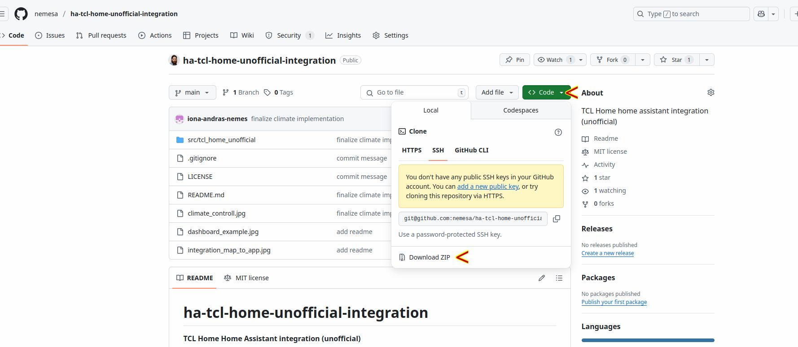
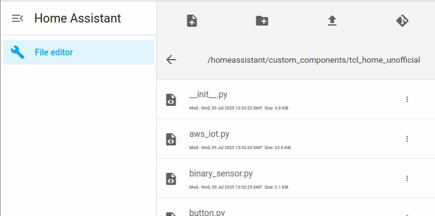
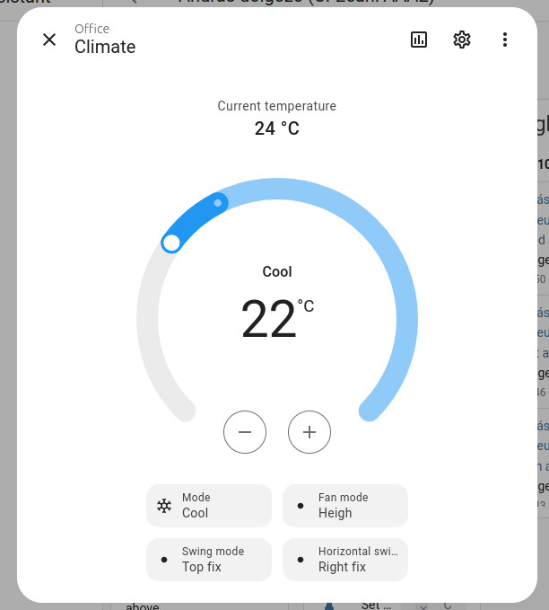

# ha-tcl-home-unofficial-integration  
**TCL Home - Home Assistant integration (unofficial)**

## Discord invite link
For direct messages or for collaboration with missing device types
https://discord.gg/8AcrRmNfVj

## Known issues
- 

## Supported device types
- Split AC  

## Credit  
The idea for basic login is from [DavidIlie’s project](https://github.com/DavidIlie/tcl-home-ac).  
The Home Assistant integration [samples](https://github.com/msp1974/HAIntegrationExamples) helped a lot.

## How it works  
This integration is the result of reverse-engineering the “TCL Home” Android app. For setup, we only need the username/password used for the app. Since this is not an official integration from TCL, I recommend creating a new user for this integration and sharing your devices with that user—just in case TCL decides to ban the account.

## How to install  
This may eventually become available in the [HACS](https://www.home-assistant.io/integrations), but for now installation is manual only.

### Steps:
1. Download the ZIP from GitHub and extract `ha-tcl-home-unofficial-integration-main.zip`.  

2. At HomeAssistant Host, create a folder named `custom_components` next to your `configuration.yaml` (if you don't already have one).  
3. Inside `custom_components`, create a folder named `tcl_home_unofficial`.  
4. Copy all files from the ZIP’s `/ha-tcl-home-unofficial-integration-main/src/tcl_home_unofficial/` folder into your new `custom_components/tcl_home_unofficial` folder. Should look like this: 

Note the translations folder with the en.json, you have to copy that foler and file too.
5. Restart Home Assistant.  
6. In the Home Assitant go to **Settings → Devices & Services → + Add Integration**, then search for “TCL Home” and follow the setup steps.

---

Optionally, you can install the File Editor add-on to create the folders and upload files or to edit `configuration.yaml`
Install it at:  
Home Assitant **Settings → Add-ons**, then search for “File editor.”

## Logs
For info logs extend the `configuration.yaml` with
   ```yaml
    logger:
      logs:
        custom_components.tcl_home_unofficial: info
   ```  

## How the integration looks

Climate contoll implementaion:



Dashboard example:  


Integration mapping to the app (out dated picture, now less redundant sensors and +climate type controll):  

