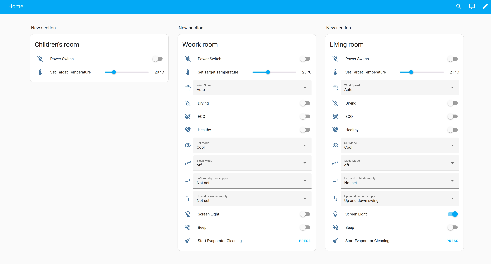
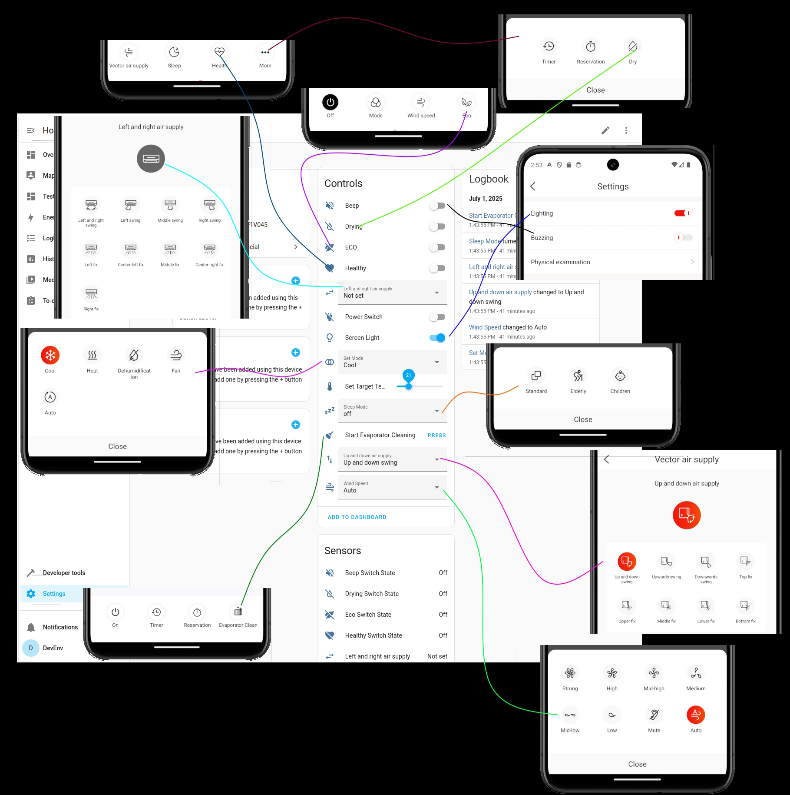

# ha-tcl-home-unofficial-integration
TCL Home home assistant integration (unofficial)

## Known issues:
 - no branding icons/logos
 - Error: The tcl_home_unofficial integration does not support YAML configuration
 - connection lost after a a few hours

## Supported device types
 - Split AC

## Credit:
The idea how to do basic login is from [DavidIlie's proejct ](https://github.com/DavidIlie/tcl-home-ac)

This Home Assistant integration [samples](https://github.com/msp1974/HAIntegrationExamples) helped a lot.

## How it's work

This integration is the result of a reverse enginering of the "TCL Home" andoid app.
For setup we only need the user/pass which is used for the app.
(as this is not offical integration from TCL I would recomend to create a new user for this integration and share your devices to that use, in case of TCL decide to ban the user)

## How to install
Download zip from GitHub

extract the ha-tcl-home-unofficial-integration-main.zip 

create a folder "custom_components" next to your configuration.yaml (if you don't have it allready)
then create a "tcl_home_unofficial" folder in the "custom_components"
copy every file from the zip's "/ha-tcl-home-unofficial-integration-main/src/tcl_home_unofficial/" folder 
into new the /homeassistant/custom_components/tcl_home_unofficial what we just created

edit your configuration.yaml and add
"tcl_home_unofficial:"

restart home assistant

Settings -> Devices & Services -> + Add Integration (button) -> search for "TCL Home"

Follow conf steps

OPTIONAL:
Settings -> Add-ons
search for
File editor

## How the integration looks like

Dashborad example

Integration mapping to the app:

