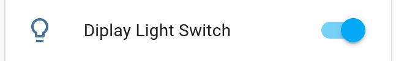

# ha-tcl-home-unofficial-integration  
**TCL Home - Home Assistant integration (unofficial)**

## Known issues
- Split AC Fresh air - power statics not implemented

## Supported device types
- Split AC
- Split AC Fresh air
- Portable AC
- Window AC
- Dehumidifier (DEM)

## Notes by device types

### Portable AC 

  No ad-hoc temperature type change between Celsius and Fahrenheit; it will use the System-defined temperature type.

## Unsupported device types
  Devices not recognized by the integration will be create as a remote. The device type will be shown, under The Device Info in this sample it's "Smart TV"
  Use this type when requesting support for it


  

## Credit  
The idea for basic login is from [DavidIlie’s project](https://github.com/DavidIlie/tcl-home-ac).  
The Home Assistant integration [samples](https://github.com/msp1974/HAIntegrationExamples) helped a lot.

## Discord invite link
For direct messages or for collaboration with missing device types
https://discord.gg/8AcrRmNfVj

## How it works  
This integration is the result of reverse-engineering the “TCL Home” Android app. For setup, we only need the username/password used for the app. Since this is not an official integration from TCL, I recommend creating a new user for this integration and sharing your devices with that user—just in case TCL decides to ban the account.

## How to install 
### HACS
This integration is now awaliable in HACS, just search for "TCL Home"


### Update from Manual to HACS
If you already had a manual installation by hand and now you want to use HACS, just simply download the integration with HACS; it will overwrite the manual installation. Then restart Home Assistant.

### Manual instalion
### Steps:
1. Download the ZIP from GitHub and extract `ha-tcl-home-unofficial-integration-main.zip`.  

2. At HomeAssistant Host, create a folder named `custom_components` next to your `configuration.yaml` (if you don't already have one).  
3. Inside `custom_components`, create a folder named `tcl_home_unofficial`.  
4. Copy all files from the ZIP’s `/ha-tcl-home-unofficial-integration-main/custom_components/tcl_home_unofficial/` folder into your new `custom_components/tcl_home_unofficial` folder. Should look like this: 

Note the translations folder with the en.json, you have to copy that foler and file too.
5. Restart Home Assistant.  
6. In the Home Assitant go to **Settings → Devices & Services → + Add Integration**, then search for “TCL Home” and follow the setup steps.

---

Optionally, you can install the File Editor add-on to create the folders and upload files or to edit `configuration.yaml`
Install it at:  
Home Assitant **Settings → Add-ons**, then search for “File editor.”

## Logs
For info logs extend the `configuration.yaml` with
   ```yaml
    logger:
      logs:
        custom_components.tcl_home_unofficial: info
   ```  
Logs can be found in Home Assistant at Settings->System->Logs menu:
then "Show full logs" in the "..." menu


Then the integration related logs will start with
[custom_components.tcl_home_unofficial...


## Diagnosics files

### Config diagnostic
In Home Assistant go to
Settings -> "Devices & services" -> on the Integrations tab find the "TCL Home - Unofficial" integartion
In the "..." menu select the "Download diagnostics"


### Device diagnostic
Same path as for the "Config diagnostic" select the device, then user
the "DOWNLOAD DIAGNOSTICS" link


## Functions map

### SELECT_MODE
SELECT_MODE
| Home Assistan                                                  | TCL app                                                         | Alternative (for different device type) |
| :------------------------------------------------------------: | :-------------------------------------------------------------: |:-:|
|  |  ||

#### MODE_AC_AUTO
#### MODE_AC_COOL
#### MODE_AC_DEHUMIDIFICATION
#### MODE_AC_FAN
#### MODE_AC_HEAT

### SWITCH_POWER

SWITCH_POWER - Powers on or powers off the device

|  Value    | Home Assistan                                                  | TCL app                                                         | Alternative (for different device type) |
|  :------- | :------------------------------------------------------------: | :-------------------------------------------------------------: |:-:|
|  Off      |  |  ||
|  On       |  |  ||


### SELECT_WIND_SPEED

SELECT_WIND_SPEED - 

|  Value    | Home Assistan                                                  | TCL app                                                         | Alternative (for different device type) |
|  :------- | :------------------------------------------------------------: | :-------------------------------------------------------------: |:-:|
|            |  |  ||
|  AUTO      |  |  ||


### SWITCH_BEEP

SWITCH_BEEP - 

|  Value    | Home Assistan                                                  | TCL app                                                         | Alternative (for different device type) |
|  :------- | :------------------------------------------------------------: | :-------------------------------------------------------------: |:-:|
|  Off      |  |  ||
|  On       |  |  ||

### SWITCH_ECO

SWITCH_ECO - 

|  Value    | Home Assistan                                                  | TCL app                                                         | Alternative (for different device type) |
|  :------- | :------------------------------------------------------------: | :-------------------------------------------------------------: |:-:|
|  Off      |  |  ||
|  On       |  |  ||


### SWITCH_AI_ECO

SWITCH_AI_ECO - 

|  Value    | Home Assistan                                                  | TCL app                                                         | Alternative (for different device type) |
|  :------- | :------------------------------------------------------------: | :-------------------------------------------------------------: |:-:|
|            | | ||


### SWITCH_HEALTHY

SWITCH_HEALTHY - 

|  Value    | Home Assistan                                                  | TCL app                                                         | Alternative (for different device type) |
|  :------- | :------------------------------------------------------------: | :-------------------------------------------------------------: |:-:|
|  Off      |  |  ||
|  On       |  |  ||


### SWITCH_DRYING

SWITCH_DRYING - 

|  Value    | Home Assistan                                                  | TCL app                                                         | Alternative (for different device type) |
|  :------- | :------------------------------------------------------------: | :-------------------------------------------------------------: |:-:|
|  Off      |  | (in "... More")  | (in Settings) |
|  On       |  |  ||

### SWITCH_SCREEN

SWITCH_SCREEN - 

|  Value    | Home Assistan                                                  | TCL app                                                         | Alternative (for different device type) |
|  :------- | :------------------------------------------------------------: | :-------------------------------------------------------------: |:-:|
|  Off      |  |  ||
|  On       |  |  ||


### SWITCH_LIGHT_SENSE

SWITCH_LIGHT_SENSE - 

|  Value    | Home Assistan                                                  | TCL app                                                         | Alternative (for different device type) |
|  :------- | :------------------------------------------------------------: | :-------------------------------------------------------------: |:-:|
|  Off      | TODO:add pic | (in Settings)  ||
|  On       | TODO:add pic |TODO:add pic ||


### SWITCH_SWING_WIND

SWITCH_SWING_WIND - 

|  Value    | Home Assistan                                                  | TCL app                                                         | Alternative (for different device type) |
|  :------- | :------------------------------------------------------------: | :-------------------------------------------------------------: |:-:|
|  On       | TODO:add pic |TODO:add pic ||
|  Off       | TODO:add pic |TODO:add pic ||

### SWITCH_SLEEP

SWITCH_SLEEP - 

|  Value    | Home Assistan                                                  | TCL app                                                         | Alternative (for different device type) |
|  :------- | :------------------------------------------------------------: | :-------------------------------------------------------------: |:-:|
|  On       | TODO:add pic |TODO:add pic ||
|  Off      | TODO:add pic |TODO:add pic ||

### SWITCH_8_C_HEATING

SWITCH_8_C_HEATING - 

|  Value    | Home Assistan                                                  | TCL app                                                         | Alternative (for different device type) |
|  :------- | :------------------------------------------------------------: | :-------------------------------------------------------------: |:-:|
|  Off      |  |  ||
|  On       |  |  ||

### SWITCH_SOFT_WIND

SWITCH_SOFT_WIND - 

|  Value    | Home Assistan                                                  | TCL app                                                         | Alternative (for different device type) |
|  :------- | :------------------------------------------------------------: | :-------------------------------------------------------------: |:-:|
|  On       | TODO:add pic |TODO:add pic ||
|  Off      | TODO:add pic |TODO:add pic ||

### SWITCH_FRESH_AIR

SWITCH_FRESH_AIR - 

|  Value    | Home Assistan                                                  | TCL app                                                         | Alternative (for different device type) |
|  :------- | :------------------------------------------------------------: | :-------------------------------------------------------------: |:-:|
|  On       | TODO:add pic |TODO:add pic ||
|  Off      | TODO:add pic |TODO:add pic ||

### SELECT_WIND_SPEED_7_GEAR

SELECT_WIND_SPEED_7_GEAR - 

| Home Assistan                                                  | TCL app                                                         | Alternative (for different device type) |
| :------------------------------------------------------------: | :-------------------------------------------------------------: |:-:|
| TODO:add pic |TODO:add pic ||

### SELECT_WINDOW_AS_WIND_SPEED

SELECT_WINDOW_AS_WIND_SPEED - 

| Home Assistan                                                  | TCL app                                                         | Alternative (for different device type) |
| :------------------------------------------------------------: | :-------------------------------------------------------------: |:-:|
| TODO:add pic |TODO:add pic ||

### SELECT_WIND_FEELING

SELECT_WIND_FEELING - 

| Home Assistan                                                  | TCL app                                                         | Alternative (for different device type) |
| :------------------------------------------------------------: | :-------------------------------------------------------------: |:-:|
| TODO:add pic |TODO:add pic ||

### SELECT_VERTICAL_DIRECTION

SELECT_VERTICAL_DIRECTION - 

| Home Assistan                                                  | TCL app                                                         | Alternative (for different device type) |
| :------------------------------------------------------------: | :-------------------------------------------------------------: |:-:|
|  |  ||

### SELECT_HORIZONTAL_DIRECTION

SELECT_HORIZONTAL_DIRECTION - 

|  Value    | Home Assistan                                                  | TCL app                                                         | Alternative (for different device type) |
|  :------- | :------------------------------------------------------------: | :-------------------------------------------------------------: |:-:|
|  |  ||

### SELECT_SLEEP_MODE

SELECT_SLEEP_MODE - 

|  Value    | Home Assistan                                                  | TCL app                                                         | Alternative (for different device type) |
|  :------- | :------------------------------------------------------------: | :-------------------------------------------------------------: |:-:|
|  |  ||

### SELECT_FRESH_AIR

SELECT_FRESH_AIR - 

|  Value    | Home Assistan                                                  | TCL app                                                         | Alternative (for different device type) |
|  :------- | :------------------------------------------------------------: | :-------------------------------------------------------------: |:-:|
| TODO:add pic |TODO:add pic ||

### SELECT_GENERATOR_MODE

SELECT_GENERATOR_MODE - 

|  Value    | Home Assistan                                                  | TCL app                                                         | Alternative (for different device type) |
|  :------- | :------------------------------------------------------------: | :-------------------------------------------------------------: |:-:|
| TODO:add pic |TODO:add pic ||

### SELECT_TEMPERATURE_TYPE

SELECT_TEMPERATURE_TYPE - not enabled to any devices as integrations is using °C and the Home Assistant will convert the user's System Temperature Unit.

### SELECT_PORTABLE_WIND_SPEED

SELECT_PORTABLE_WIND_SPEED - 

|  Value    | Home Assistan                                                  | TCL app                                                         | Alternative (for different device type) |
|  :------- | :------------------------------------------------------------: | :-------------------------------------------------------------: |:-:|
| TODO:add pic |TODO:add pic ||

### SELECT_PORTABLE_WIND_4VALUE_SPEED

SELECT_PORTABLE_WIND_4VALUE_SPEED - 

|  Value    | Home Assistan                                                  | TCL app                                                         | Alternative (for different device type) |
|  :------- | :------------------------------------------------------------: | :-------------------------------------------------------------: |:-:|
| TODO:add pic |TODO:add pic ||

### BUTTON_SELF_CLEAN

BUTTON_SELF_CLEAN - 

|  Value               | Home Assistan                                                  | TCL app                                                         | Alternative (for different device type) |
|  :------------------ | :------------------------------------------------------------: | :-------------------------------------------------------------: |:-:|
|  press to start      |  |  ||
|  press to stop       | TODO:Fix text ("start" should be "stop")  |  ||

### NUMBER_TARGET_TEMPERATURE

NUMBER_TARGET_TEMPERATURE - 
NUMBER_TARGET_DEGREE
NUMBER_TARGET_TEMPERATURE_ALLOW_HALF_DIGITS

| Home Assistan                                                  | TCL app                                                         | Alternative (for different device type) |
| :------------------------------------------------------------: | :-------------------------------------------------------------: |:-:|
| TODO:add pic |TODO:add pic ||

### CLIMATE

CLIMATE

| Home Assistan                                                  | TCL app                                                         | Alternative (for different device type) |
| :------------------------------------------------------------: | :-------------------------------------------------------------: |:-:|
| TODO:add pic |TODO:add pic ||

### SENSOR_CURRENT_TEMPERATURE

SENSOR_CURRENT_TEMPERATURE

| Home Assistan                                                  | TCL app                                                         | Alternative (for different device type) |
| :------------------------------------------------------------: | :-------------------------------------------------------------: |:-:|
| TODO:add pic |TODO:add pic ||

### SENSOR_INTERNAL_UNIT_COIL_TEMPERATURE

SENSOR_INTERNAL_UNIT_COIL_TEMPERATURE

| Home Assistan                                                  | TCL app                                                         | Alternative (for different device type) |
| :------------------------------------------------------------: | :-------------------------------------------------------------: |:-:|
| TODO:add pic |TODO:add pic ||

### SENSOR_EXTERNAL_UNIT_COIL_TEMPERATURE

SENSOR_EXTERNAL_UNIT_COIL_TEMPERATURE

| Home Assistan                                                  | TCL app                                                         | Alternative (for different device type) |
| :------------------------------------------------------------: | :-------------------------------------------------------------: |:-:|
| TODO:add pic |TODO:add pic ||

### SENSOR_EXTERNAL_UNIT_TEMPERATURE

SENSOR_EXTERNAL_UNIT_TEMPERATURE

| Home Assistan                                                  | TCL app                                                         | Alternative (for different device type) |
| :------------------------------------------------------------: | :-------------------------------------------------------------: |:-:|
| TODO:add pic |TODO:add pic ||

### SENSOR_EXTERNAL_UNIT_EXHAUST_TEMPERATURE

SENSOR_EXTERNAL_UNIT_EXHAUST_TEMPERATURE

| Home Assistan                                                  | TCL app                                                         | Alternative (for different device type) |
| :------------------------------------------------------------: | :-------------------------------------------------------------: |:-:|
| TODO:add pic |TODO:add pic ||

### USER_CONFIG_BEHAVIOR_MEMORIZE_TEMP_BY_MODE

USER_CONFIG_BEHAVIOR_MEMORIZE_TEMP_BY_MODE

| Home Assistan                                                  | TCL app                                                         | Alternative (for different device type) |
| :------------------------------------------------------------: | :-------------------------------------------------------------: |:-:|
| TODO:add pic |TODO:add pic ||
  

### USER_CONFIG_BEHAVIOR_MEMORIZE_FAN_SPEED_BY_MODE

USER_CONFIG_BEHAVIOR_MEMORIZE_FAN_SPEED_BY_MODE

| Home Assistan                                                  | TCL app                                                         | Alternative (for different device type) |
| :------------------------------------------------------------: | :-------------------------------------------------------------: |:-:|
| TODO:add pic |TODO:add pic ||
  

### USER_CONFIG_BEHAVIOR_SILENT_BEEP_WHEN_TURN_ON

USER_CONFIG_BEHAVIOR_SILENT_BEEP_WHEN_TURN_ON

| Home Assistan                                                  | TCL app                                                         | Alternative (for different device type) |
| :------------------------------------------------------------: | :-------------------------------------------------------------: |:-:|
| TODO:add pic |TODO:add pic ||
  
    


## How the integration looks

Climate contoll implementaion:


Dashboard example:  


